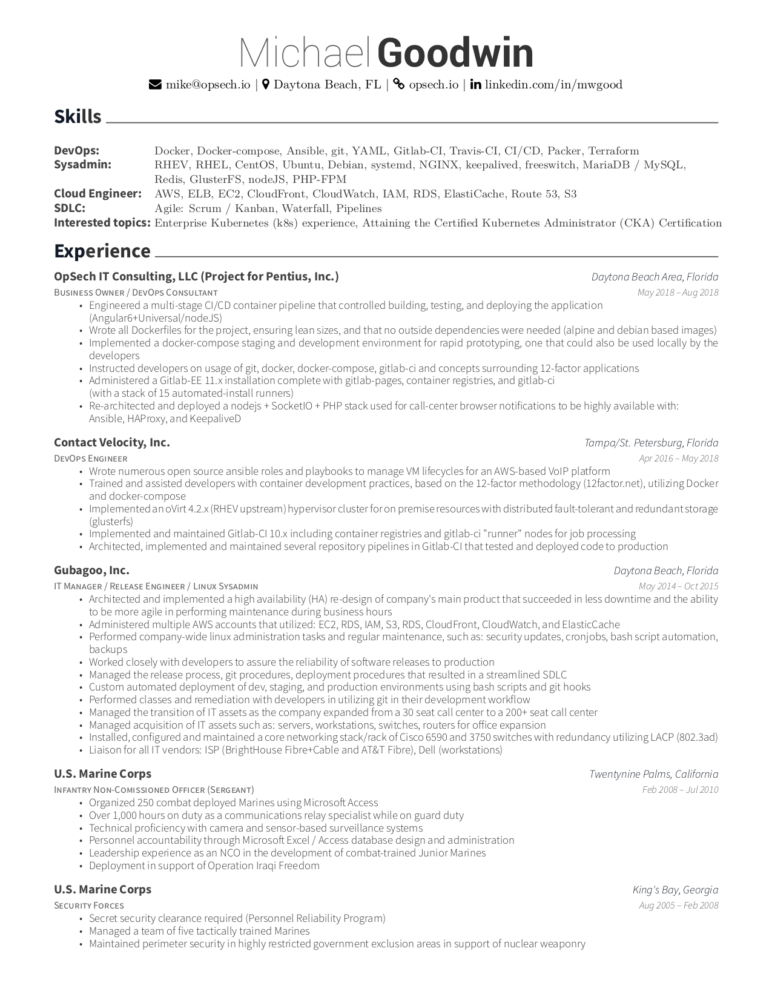
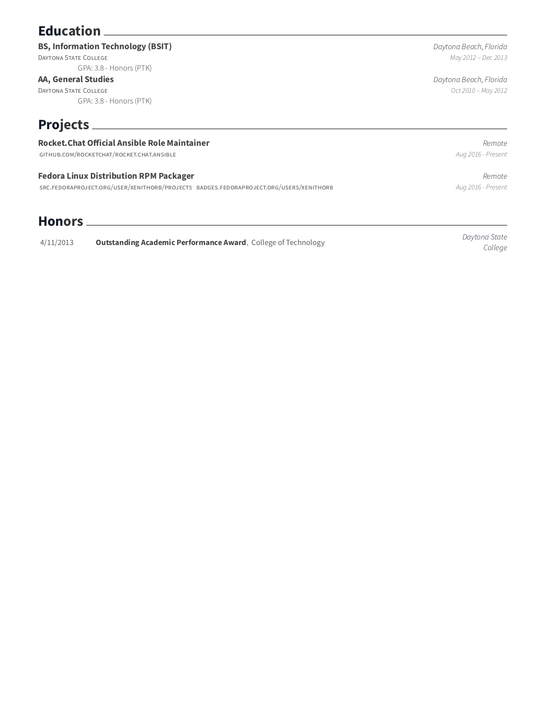

## Usage (Docker style)
To generate a PDF from this LaTeX code, navigate to this folder in a terminal and run:

    docker build -t resume . && docker run -it -v "$PWD:/src:Z" resume

Alternatively, which runs the same command above

    make docker 

## Usage (Classic on Fedora)
To generate a PDF from this LaTeX code, navigate to this folder in a terminal and run:

    dnf install -y texlive-scheme-small poppler-utils
    make 

Or 

    make pdf
    make png

## Requirements (without docker)
You will need to have `xelatex` installed on your machine. On Fedora:

    sudo dnf install -y texlive-scheme-small

## Current Version

